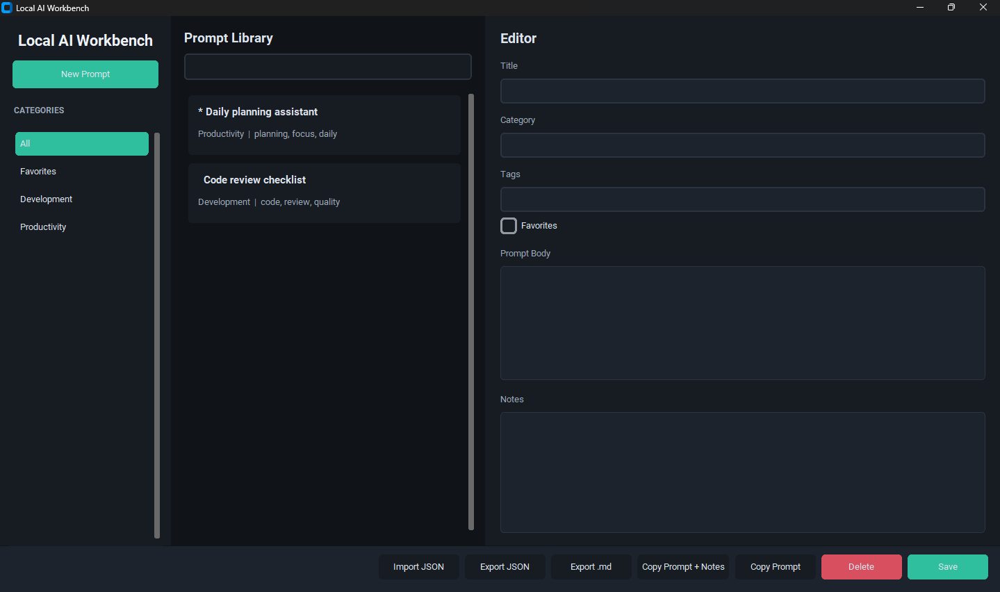

# Local AI Workbench / Banco IA


Portable Windows desktop app for managing AI prompts, notes, reusable instructions, and Markdown/JSON exports. No installation required.

Aplicación portátil de escritorio para Windows para administrar prompts de IA, notas, instrucciones reutilizables y exportaciones Markdown/JSON. No requiere instalación.

## Preview / Vista previa




## Download / Descarga

Download the latest portable Windows executables from:

[Latest release](https://github.com/federicoramos67/local-ai-workbench/releases/latest)

Descarga los ejecutables portátiles más recientes para Windows desde:

[Última versión](https://github.com/federicoramos67/local-ai-workbench/releases/latest)

## English

Local AI Workbench is a local productivity tool for storing, searching, reusing, importing, and exporting AI prompts. It uses SQLite for local storage and does not require an external API.

### Features

- Prompt library with title, category, tags, prompt body, and favorite toggle.
- Search by title, tag, category, or prompt text.
- Category sidebar and favorites filter.
- Notes linked to each prompt for observations, results, and reuse context.
- Export the selected prompt as Markdown.
- Export and import the full prompt library as JSON.
- Copy the prompt or prompt plus notes to the clipboard.
- English and Spanish launchers with shared backend logic.
- Auto-created local database at `data/workbench.db`.

### Run From Source

```powershell
python -m venv .venv
.\.venv\Scripts\Activate.ps1
pip install -r requirements.txt
python main.py
```

Spanish UI:

```powershell
python main_es.py
```

### Build Windows Executables

```powershell
.\build_exe.ps1
```

The build script removes old `build/`, `dist/`, and `.spec` files, packages CustomTkinter and Tkinter/Tcl/Tk assets, creates both executables, and performs a launch check.

Generated files:

- `dist/LocalAIWorkbench_EN.exe`
- `dist/BancoIA_ES.exe`

### Project Structure

```text
main.py          English launcher
main_es.py       Spanish launcher
app_ui.py        CustomTkinter interface
database.py      SQLite schema and persistence
models.py        Shared data models
exporter.py      Markdown and JSON export helpers
utils.py         App paths and utility helpers
hooks/           PyInstaller hooks for Tkinter packaging
requirements.txt Python dependencies
README.md        Bilingual documentation
build_exe.ps1    PyInstaller build script
.gitignore       Ignored generated files
data/            Auto-created local database folder
```

## Español

Banco IA es una aplicación local de productividad para guardar, buscar, reutilizar, importar y exportar prompts de IA. Usa SQLite para el almacenamiento local y no requiere una API externa.

### Funciones

- Biblioteca de prompts con título, categoría, etiquetas, cuerpo del prompt y marcador de favorito.
- Búsqueda por título, etiqueta, categoría o texto del prompt.
- Barra lateral de categorías y filtro de favoritos.
- Notas vinculadas a cada prompt para observaciones, resultados y contexto de reutilización.
- Exportación del prompt seleccionado como Markdown.
- Exportación e importación de toda la biblioteca como JSON.
- Copia del prompt o del prompt con notas al portapapeles.
- Lanzadores en inglés y español con lógica compartida.
- Base de datos local creada automáticamente en `data/workbench.db`.

### Ejecutar Desde Código Fuente

```powershell
python -m venv .venv
.\.venv\Scripts\Activate.ps1
pip install -r requirements.txt
python main.py
```

Interfaz en español:

```powershell
python main_es.py
```

### Crear Ejecutables Para Windows

```powershell
.\build_exe.ps1
```

El script limpia `build/`, `dist/` y archivos `.spec`, incluye los recursos de CustomTkinter y Tkinter/Tcl/Tk, genera ambos ejecutables y verifica que se puedan iniciar.

Archivos generados:

- `dist/LocalAIWorkbench_EN.exe`
- `dist/BancoIA_ES.exe`

### Estructura Del Proyecto

```text
main.py          Lanzador en inglés
main_es.py       Lanzador en español
app_ui.py        Interfaz con CustomTkinter
database.py      Esquema SQLite y persistencia
models.py        Modelos de datos compartidos
exporter.py      Exportación Markdown y JSON
utils.py         Rutas de la aplicación y utilidades
hooks/           Hooks de PyInstaller para empaquetar Tkinter
requirements.txt Dependencias de Python
README.md        Documentación bilingüe
build_exe.ps1    Script de compilación con PyInstaller
.gitignore       Archivos generados ignorados
data/            Carpeta de base de datos local auto-creada
```
